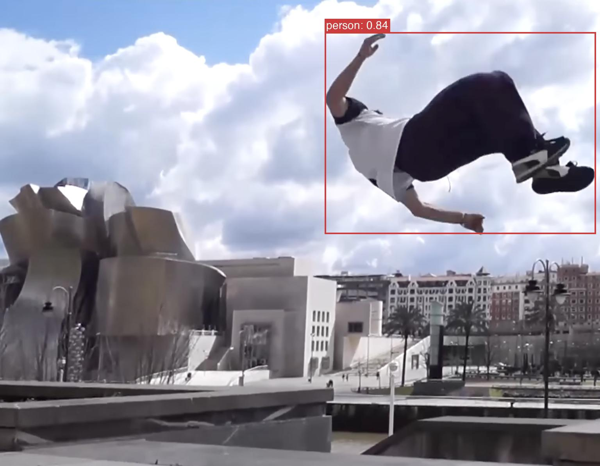

# LibreYOLO

[](https://docs.libreyolo.com)
[](https://pypi.org/project/libreyolo/)
[](LICENSE)

MIT-licensed YOLO implementation supporting inference for YOLOv8 (n, s, m, l, x), YOLOv9 (t, s, m, c), YOLOv11 (n, s, m, l, x), and YOLOX (nano, tiny, s, m, l, x).

Training support is under development



## Installation

```bash
pip install libreyolo
```

## Quick Start

```python
from libreyolo import LIBREYOLO

# Auto-detect model version and size (new)
model = LIBREYOLO("libreyolo8n.pt")
results = model(image="https://raw.githubusercontent.com/Libre-YOLO/libreyolo/main/media/parkour.jpg", save=True)

print(f"Detected {results['num_detections']} objects")

# Or specify size explicitly (backward compatible)
# model = LIBREYOLO("libreyolo8n.pt", size="n")
```

## Documentation

Full documentation at [docs.libreyolo.com](https://docs.libreyolo.com):

## License

- **Code:** MIT License
- **Weights:** Pre-trained weights may inherit licensing from the original source
